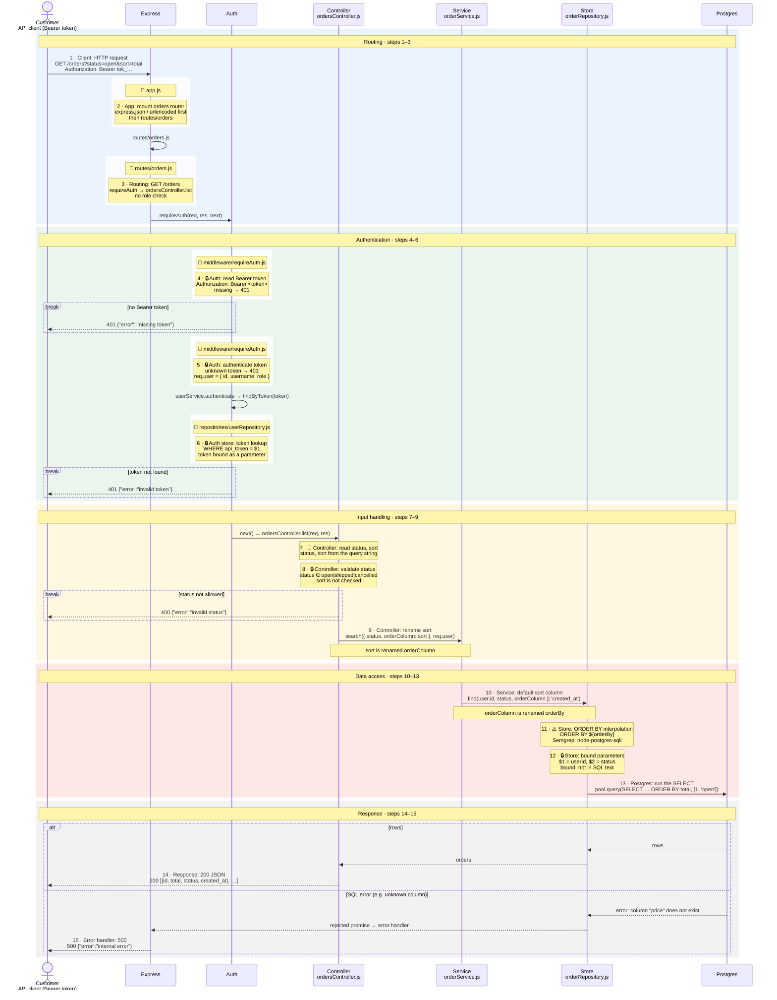

# List my orders (GET /orders?status=&sort=)

How a signed-in customer lists their own orders, filtered by status and sorted by a column, from the request to the SELECT ... ORDER BY statement flagged by Semgrep (src/repositories/orderRepository.js:8).

**Legend:** coloured bands are phases · 🔒 security control · ⚠️ sink / scanner finding · 🎯 untrusted source · solid arrows are calls, dashed are returns and responses · `break` boxes stop the request · in lanes with several files, each file's steps sit in a white box headed 📄 *file*, stacked in call order.

| # | Step | Code |
|---|---|---|
| 1 | Client: HTTP request | (no code) |
| 2 | App: mount orders router | `src/app.js:11` |
| 3 | Routing: GET /orders | `src/routes/orders.js:5` |
| 4 | 🔒 Auth: read Bearer token | `src/middleware/requireAuth.js:5` |
| 5 | 🔒 Auth: authenticate token | `src/middleware/requireAuth.js:8` |
| 6 | 🔒 Auth store: token lookup | `src/repositories/userRepository.js:7` |
| 7 | 🎯 Controller: read status, sort | `src/controllers/ordersController.js:6` |
| 8 | 🔒 Controller: validate status | `src/controllers/ordersController.js:7` |
| 9 | Controller: rename sort | `src/controllers/ordersController.js:11` |
| 10 | Service: default sort column | `src/services/orderService.js:4` |
| 11 | ⚠️ Store: ORDER BY interpolation | `src/repositories/orderRepository.js:10` |
| 12 | 🔒 Store: bound parameters | `src/repositories/orderRepository.js:11` |
| 13 | Postgres: run the SELECT | (no code) |
| 14 | Response: 200 JSON | `src/controllers/ordersController.js:12` |
| 15 | Error handler: 500 | `src/app.js:18` |

CodeTour: `.tours/1-list-orders.tour` (step N matches diagram step N).
