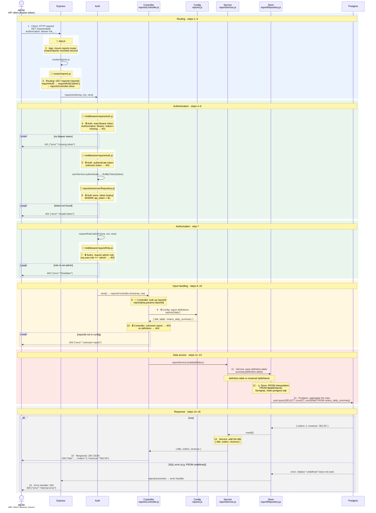

# Revenue report (GET /reports/:reportId)

How an admin fetches a revenue summary (`daily` or `monthly`), from the request through the config lookup to the SELECT ... FROM ${tableName} statement flagged by Semgrep (src/repositories/reportRepository.js:8).

**Legend:** coloured bands are phases · 🔒 security control · ⚠️ sink / scanner finding · 🎯 untrusted source · solid arrows are calls, dashed are returns and responses · `break` boxes stop the request · in lanes with several files, each file's steps sit in a white box headed 📄 *file*, stacked in call order.

| # | Step | Code |
|---|---|---|
| 1 | Client: HTTP request | (no code) |
| 2 | App: mount reports router | `src/app.js:12` |
| 3 | Routing: GET /reports/:reportId | `src/routes/reports.js:6` |
| 4 | 🔒 Auth: read Bearer token | `src/middleware/requireAuth.js:5` |
| 5 | 🔒 Auth: authenticate token | `src/middleware/requireAuth.js:8` |
| 6 | 🔒 Auth store: token lookup | `src/repositories/userRepository.js:7` |
| 7 | 🔒 Authz: require admin role | `src/middleware/requireRole.js:2` |
| 8 | 🎯 Controller: look up reportId | `src/controllers/reportsController.js:5` |
| 9 | 🔒 Config: report definitions | `src/config/reports.js:2` |
| 10 | 🔒 Controller: unknown report → 404 | `src/controllers/reportsController.js:6` |
| 11 | Service: pass definition.table | `src/services/reportService.js:4` |
| 12 | ⚠️ Store: FROM interpolation | `src/repositories/reportRepository.js:8` |
| 13 | Postgres: aggregate the view | (no code) |
| 14 | Service: add the title | `src/services/reportService.js:5` |
| 15 | Response: 200 JSON | `src/controllers/reportsController.js:8` |
| 16 | Error handler: 500 | `src/app.js:18` |

CodeTour: `.tours/2-show-report.tour` (step N matches diagram step N).
