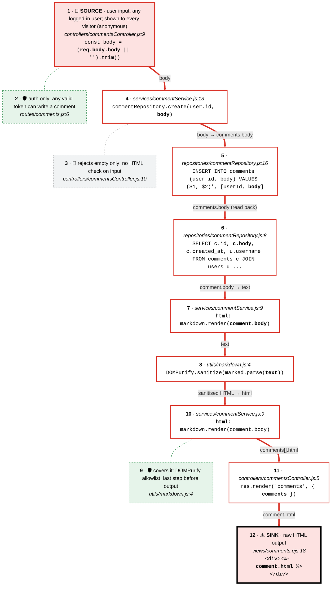

# Source to sink 3 · comment body → <%- comment.html %>

Follows the value printed raw by `<%- comment.html %>` in src/views/comments.ejs:18 (Semgrep template-explicit-unescape) back through the comments table to the POST /comments body that writes it.

**Legend:** one chain per source, top to bottom · top card = source (🔴 user input · 🔵 config · ⚪ constant · 🟢 authenticated identity · 🟣 stored data · 🟠 external service) · each card is a line of code with the value in **bold**, and each arrow says what the value is called next · ⚠️ sink has a thick black frame · dashed side cards: 🚫 a control on the path that does not cover the value, 🛡 one that does, ✋ a path that stops before the sink.

| Source | Origin | Details | Reaches the sink? | Controls on the path |
|---|---|---|---|---|
| 1 · SOURCE: req.body.body | 🔴 user input | user input, any logged-in user; shown to every visitor (anonymous) | **Yes** | 🛡 2: auth only: any valid token can write a comment 🚫 3: rejects empty only; no HTML check on input 🛡 9: covers it: DOMPurify allowlist, last step before output |

| # | Card | Code | Tour highlights |
|---|---|---|---|
| 1 | 🔴 SOURCE: req.body.body | `src/controllers/commentsController.js:9` | `req.body.body` |
| 2 | 🛡 Check on the path: requireAuth on POST | `src/routes/comments.js:6` | `requireAuth` |
| 3 | 🚫 Check on the path: empty comment | `src/controllers/commentsController.js:10` | `if (!body)` |
| 4 |  body → commentRepository.create | `src/services/commentService.js:13` | `body` |
| 5 |  Stored in comments.body | `src/repositories/commentRepository.js:16` | `body` |
| 6 |  Read back for every visitor | `src/repositories/commentRepository.js:8` | `c.body` |
| 7 |  comment.body → markdown.render(text) | `src/services/commentService.js:9` | `comment.body` |
| 8 |  Markdown → HTML (marked) | `src/utils/markdown.js:4` | `text` |
| 9 | 🛡 Check on the path: DOMPurify.sanitize | `src/utils/markdown.js:4` | `DOMPurify.sanitize` |
| 10 |  Sanitised HTML → comment.html | `src/services/commentService.js:9` | `html` |
| 11 |  res.render('comments', { comments }) | `src/controllers/commentsController.js:5` | `comments` |
| 12 | ⚠️ SINK: <%- comment.html %> | `src/views/comments.ejs:18` | `comment.html` |

CodeTour: `.tours/source-to-sink-3-comment-html.tour` (step N = card N).
