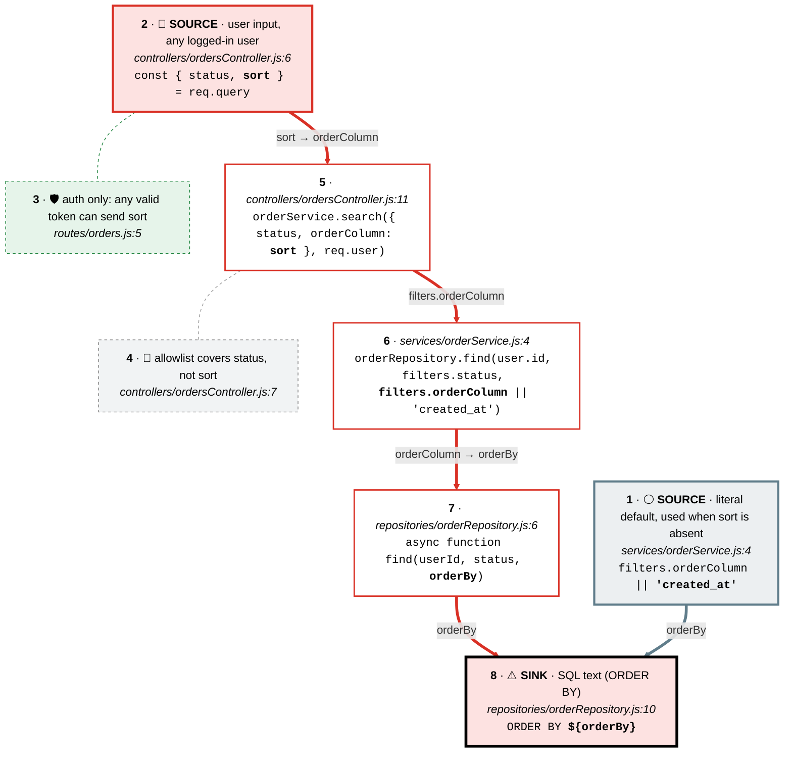

# Source to sink 1 · sort → ORDER BY ${orderBy}

Follows every value that reaches `${orderBy}` in the ORDER BY clause of orderRepository.find (Semgrep node-postgres-sqli, src/repositories/orderRepository.js:8). userId and status are bound parameters ($1, $2) and are not traced.

**Legend:** one chain per source, top to bottom · top card = source (🔴 user input · 🔵 config · ⚪ constant · 🟢 authenticated identity · 🟣 stored data · 🟠 external service) · each card is a line of code with the value in **bold**, and each arrow says what the value is called next · ⚠️ sink has a thick black frame · dashed side cards: 🚫 a control on the path that does not cover the value, 🛡 one that does, ✋ a path that stops before the sink.

| Source | Origin | Details | Reaches the sink? | Controls on the path |
|---|---|---|---|---|
| 1 · SOURCE: 'created_at' default | ⚪ constant | literal default, used when sort is absent | **Yes** | none |
| 2 · SOURCE: req.query.sort | 🔴 user input | user input, any logged-in user | **Yes** | 🛡 3: auth only: any valid token can send sort 🚫 4: allowlist covers status, not sort |

| # | Card | Code | Tour highlights |
|---|---|---|---|
| 1 | ⚪ SOURCE: 'created_at' default | `src/services/orderService.js:4` | `'created_at'` |
| 2 | 🔴 SOURCE: req.query.sort | `src/controllers/ordersController.js:6` | `sort` |
| 3 | 🛡 Check on the path: requireAuth | `src/routes/orders.js:5` | `requireAuth` |
| 4 | 🚫 Check on the path: status allowlist | `src/controllers/ordersController.js:7` | `if (status && !ALLOWED_STATUSES.includes(status))` |
| 5 |  sort → orderColumn | `src/controllers/ordersController.js:11` | `sort` |
| 6 |  orderColumn || 'created_at' | `src/services/orderService.js:4` | `filters.orderColumn` |
| 7 |  orderColumn → orderBy | `src/repositories/orderRepository.js:6` | `orderBy` |
| 8 | ⚠️ SINK: ORDER BY ${orderBy} | `src/repositories/orderRepository.js:10` | `${orderBy}` |

CodeTour: `.tours/source-to-sink-1-orders-order-by.tour` (step N = card N).
