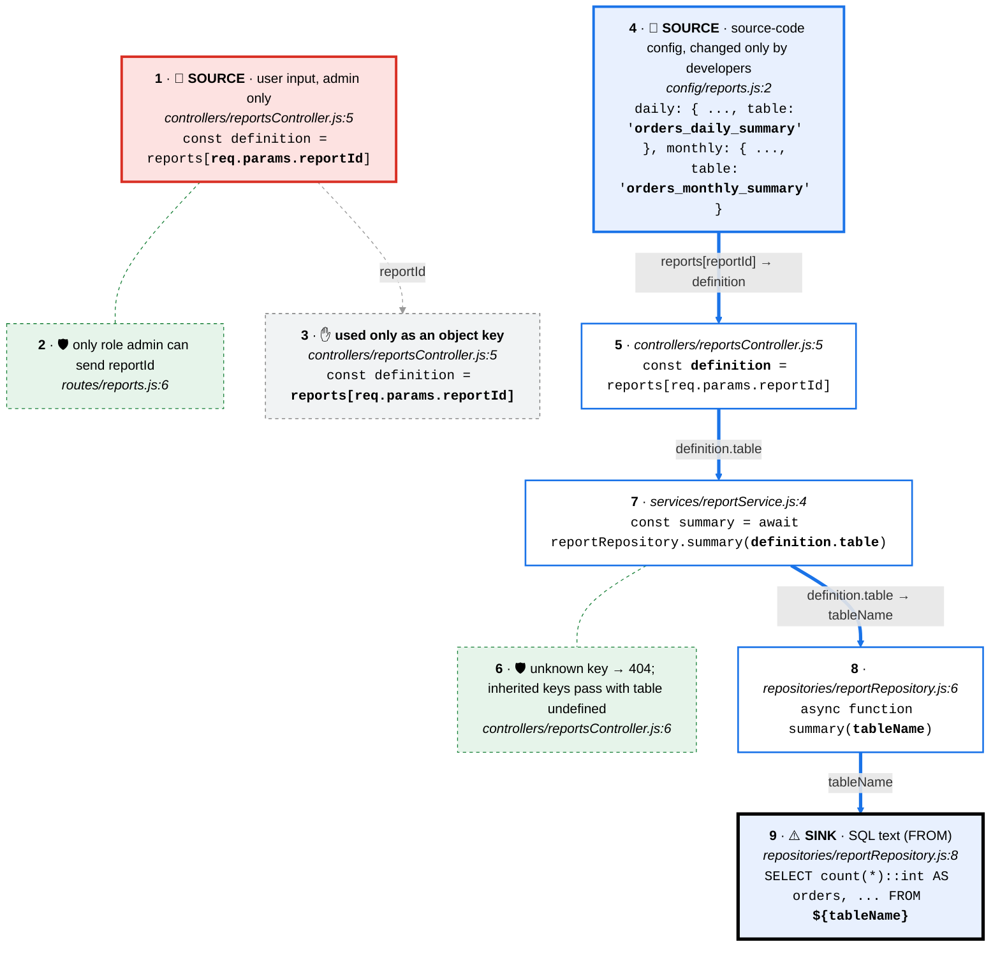

# Source to sink 2 · reports[reportId].table → FROM ${tableName}

Follows every value that reaches `${tableName}` in reportRepository.summary (Semgrep node-postgres-sqli, src/repositories/reportRepository.js:8). The user's reportId only selects a config entry; the table name itself comes from src/config/reports.js.

**Legend:** one chain per source, top to bottom · top card = source (🔴 user input · 🔵 config · ⚪ constant · 🟢 authenticated identity · 🟣 stored data · 🟠 external service) · each card is a line of code with the value in **bold**, and each arrow says what the value is called next · ⚠️ sink has a thick black frame · dashed side cards: 🚫 a control on the path that does not cover the value, 🛡 one that does, ✋ a path that stops before the sink.

| Source | Origin | Details | Reaches the sink? | Controls on the path |
|---|---|---|---|---|
| 1 · SOURCE: req.params.reportId | 🔴 user input | user input, admin only | No (✋ card 3) | 🛡 2: only role admin can send reportId |
| 4 · SOURCE: config/reports.js table names | 🔵 config | source-code config, changed only by developers | **Yes** | 🛡 6: unknown key → 404; inherited keys pass with table undefined |

| # | Card | Code | Tour highlights |
|---|---|---|---|
| 1 | 🔴 SOURCE: req.params.reportId | `src/controllers/reportsController.js:5` | `req.params.reportId` |
| 2 | 🛡 Check on the path: requireRole('admin') | `src/routes/reports.js:6` | `requireRole('admin')` |
| 3 | ✋ User input stops here | `src/controllers/reportsController.js:5` | `reports[req.params.reportId]` |
| 4 | 🔵 SOURCE: config/reports.js table names | `src/config/reports.js:2` | `daily: { title: 'Orders in the last 24 hours', table: 'orders_daily_summary' },` |
| 5 |  reports[reportId] → definition | `src/controllers/reportsController.js:5` | `definition` |
| 6 | 🛡 Check on the path: !definition → 404 | `src/controllers/reportsController.js:6` | `if (!definition) return res.status(404).json({ error: 'unknown report' });` |
| 7 |  definition.table → summary() | `src/services/reportService.js:4` | `definition.table` |
| 8 |  definition.table → tableName | `src/repositories/reportRepository.js:6` | `tableName` |
| 9 | ⚠️ SINK: FROM ${tableName} | `src/repositories/reportRepository.js:8` | `${tableName}` |

CodeTour: `.tours/source-to-sink-2-report-table-name.tour` (step N = card N).
