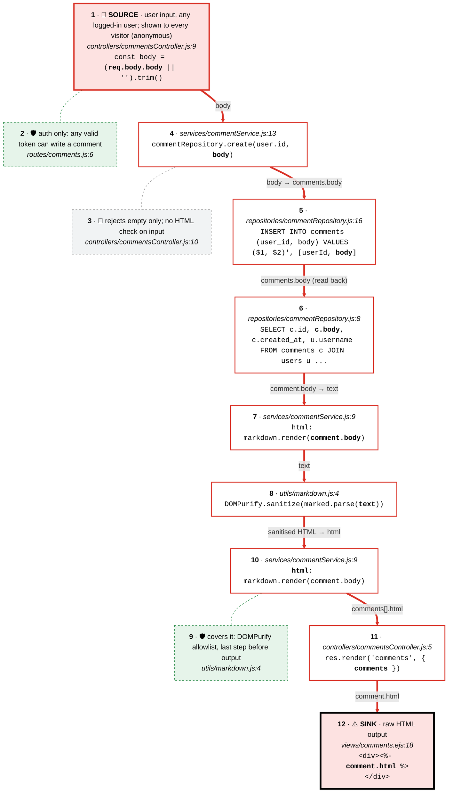

# Semgrep triage: semgrep-triage-demo (EJS unescaped output)

- **Scan:** Semgrep 1.177.0 · `p/default` (WARNING and ERROR, `scripts/scan.sh`) · 4 findings (4 WARNING) · `semgrep.json` of 2026-09-28 · triaged 2026-10-06. **Scope of this triage: scan item 4, `template-explicit-unescape`**, numbered F3 to follow the SQL injection triage (F1, F2 in `docs/triage/semgrep-triage.md`). The path-traversal finding (scan item 3) is not covered.
- **Method:** each finding → source-to-sink trace → controls checked against the wiki (threat page + stack example file, including *Bypasses to check*) → verdict → severity from the rubric below.
- **Traces and tours:** `docs/traces/*.md` and `.tours/source-to-sink-*.tour`. Tour step N = card N in each diagram.
- **Assumptions:**
  - Sign-up is closed: no registration route in `src/routes/`; users exist only from `db/init.sql:29` (README lists three seeded tokens). Comment authors are therefore the seeded users; readers of `GET /comments` are anyone, including anonymous visitors.
  - Stack: `express` 5.2.1, `ejs` 3.1.10, `marked` 16.4.2, `isomorphic-dompurify` 2.36.0 (DOMPurify 3.4.16 on jsdom), `pg`, `node`.
  - Postgres was not available in this session, so the page itself was not rendered over HTTP. The sanitiser was exercised directly by calling the app's `src/utils/markdown.js` on the seeded comment bodies.

## Summary

**0 to fix.** 1 dismissed (F3): the HTML printed raw is the output of DOMPurify, run on every render as the last step; it would become a true positive if the sanitiser were removed, moved to input only, or followed by another transformation; rule kept enabled, this instance suppressed.

- **F3 · Raw Markdown HTML in comments page** · `src/views/comments.ejs:18`
  - ❌ False positive · confidence High · Semgrep: WARNING
  - Rule: keep enabled, suppress this instance

> [!info]- Severity rubric (click to expand)
> - **Impact:** what an attacker gets.
>   - **High:** read or change data beyond their own, obtain secrets or credentials, run code, act as another user.
>   - **Medium:** limited data exposure or change, or it needs another bug to matter.
>   - **Low:** minor information leak, no direct security effect.
> - **Likelihood:** who can reach it and how hard it is.
>   - **High:** unauthenticated, a single request, no victim interaction. Also **any authenticated user when anyone can sign up** (check: is there a public registration route?).
>   - **Medium:** any authenticated regular user when accounts aren't self-service, or it needs victim interaction.
>   - **Low:** a privileged role (admin, internal), or unlikely preconditions.
> - **Severity = Impact × Likelihood:**
>   - **High impact:** High likelihood → 🔴 Critical · Medium → 🟠 High · Low → 🟡 Medium
>   - **Medium impact:** High likelihood → 🟠 High · Medium → 🟡 Medium · Low → 🟢 Low
>   - **Low impact:** High likelihood → 🟡 Medium · Medium → 🟢 Low · Low → 🟢 Low
> - **Confidence** says how sure the verdict is, and what would change it.
>   - **High:** every hop confirmed in code, and the key behaviour confirmed locally or unambiguous.
>   - **Medium:** the verdict rests on a library or config behaving as documented, or one hop couldn't be confirmed.
>   - **Low:** important parts are inferred; say what's missing.

> [!info]- Rule decision guide (click to expand)
> - **Disable for this repo:** the rule can't be right in this codebase (it checks for something the design makes irrelevant), so every hit will be a false positive.
> - **Keep enabled, suppress this instance:** the rule finds real bugs in this codebase (or the pattern is worth a look every time), and this hit is an exception. Suppress it with a comment pointing at this triage, so the next reviewer sees why.
> - **Keep enabled, no suppression:** the false positive depends on something that could change soon; let it come back.

---

## F3 · Raw Markdown HTML in comments page · ❌ False positive

- **Rule:** `template-explicit-unescape` · Semgrep: WARNING, impact MEDIUM, likelihood LOW, confidence LOW
- **Location:** `src/views/comments.ejs:18` (`<%- comment.html %>`)
- **Threat:** Cross-site scripting (stored) · wiki: `threats/source-to-sink/xss.md`, `examples/xss/ejs.md`
- **Verdict:** ❌ False positive: the raw value is DOMPurify output, sanitised on every render as the last step before the template
- **Severity:** n/a
- **Confidence:** High: every hop from `POST /comments` to the template is confirmed in code, nothing touches the string after `DOMPurify.sanitize`, and running the app's own `markdown.render` locally removed the event handler from the seeded ``. It rests on DOMPurify being correct, a widely used allowlist sanitiser; a sanitiser bypass would change it.

**Sink:** `
<%- comment.html %>
` (`comments.ejs:18`): `<%-` writes `comment.html` unescaped in HTML body context. `comment.author` and the date on line 17 use `<%=` (escaped) and are out of scope.

**Inputs reaching it**
- 🔴 **`req.body.body`** (`src/controllers/commentsController.js:9`): user input, any logged-in user, stored in `comments.body` and shown to every visitor including anonymous ones → **reaches the sink only after DOMPurify** (`src/utils/markdown.js:4`)
- 🟣 Seeded rows (`db/init.sql:39-42`): stored data written by the seed script, same column, same path → reaches the sink only after DOMPurify

**Source-to-sink trace**
- Tour: `.tours/source-to-sink-3-comment-html.tour` · page: `docs/traces/comment-html.md`

<!-- trace: comment-html -->

**Controls on the path**
- `requireAuth` on `POST /comments` (`src/routes/comments.js:6`): decides who can write a comment (any valid token), not what it contains. `GET /comments` (`:5`) is public.
- 🚫 Empty-comment check (`commentsController.js:10`): doesn't cover markup; it only rejects `''`. Expected, because the design sanitises on output.
- 🛡 `DOMPurify.sanitize(marked.parse(text))` (`src/utils/markdown.js:4`): **covers it**: allowlist sanitiser (default config) applied to the final HTML, on every render, after `marked`, with nothing after it. This is the wiki's *Sanitise, then insert as HTML* option, applied on output as `ejs.md` recommends.
- 🚫 Content Security Policy: **none** (no `helmet` or CSP header in `src/`). Defence in depth only; the wiki says never the only control.

**Wiki checks** (`ejs.md` · Bypasses to check)
- *One `<%-` left among many `<%=`:* `grep -rn "<%-" src/views` → only this line, and it prints sanitised HTML: ✅
- *Helper returning pre-built HTML:* `markdown.render` is exactly such a helper, and its output is the DOMPurify result: ✅
- *Attribute context, event handlers, `style`:* the value is printed in element-body context, not inside an attribute: ✅
- *`javascript:` / `data:` / `vbscript:` URLs:* DOMPurify's default URI check removes script-capable `href`/`src` values; the seeded link (`https://example.com/track`) survives as expected: ✅
- *Client-side sinks:* the page has no `<script>` and no client code: ✅
- *Check then change:* nothing decodes, truncates or concatenates the string after `sanitize`; the service stores it straight in `html` (`commentService.js:9`): ✅
- *Stored XSS through other fields:* `author` (username) and the date are printed with `<%=`: ✅
- *`res.send()` with user string, no `Content-Type`:* `POST /comments` replies with `res.json({ ok: true })`: ✅
- *CSP weakened:* there is no CSP at all: 🚫 (defence in depth missing, not a bypass)

**Why it's a false positive:** user-written Markdown does reach `<%-`, but only as DOMPurify output computed at render time, so script-capable markup is removed before the browser sees it.

**Residual note (not a vulnerability):**
- DOMPurify's default allowlist still permits harmless-but-unwanted markup in comments, such as `<form>`, `<input>`, `<style>` and `style` attributes, which a commenter could use to restyle the page or show a fake form. Pass a narrow allowlist as in the wiki's `ejs.md` (`ALLOWED_TAGS: ['p', 'b', 'i', 'em', 'strong', 'a', 'ul', 'ol', 'li', 'code']`, `ALLOWED_ATTR: ['href']`, `ALLOWED_URI_REGEXP: /^(?:https?:|mailto:|#)/i`).
- Add a CSP (e.g. `helmet` with `script-src 'self'`) as defence in depth.
- Seeded comment 3 stores a literal `\n` (standard SQL strings don't interpret backslashes), so its list renders as one item. Cosmetic seed bug.

**Residual risk:** the verdict relies on DOMPurify and jsdom having no sanitiser bypass in the installed versions; keep `isomorphic-dompurify` updated.

**Would become a true positive if:** `DOMPurify.sanitize` is removed or moved to input only (the existing rows would then be rendered unsanitised), anything transforms the HTML after sanitising (truncating for a preview, replacing mentions, decoding entities), or the template switches to `<%- comment.body %>`.

**Rule decision: disable the rule?**
- **Decision:** keep enabled, suppress this instance.
- **Why:** 0 of this rule's 1 hit in this scan is a true positive, but raw output in EJS is rare here (one `<%-` in the views) and each new one deserves a look; disabling would hide a future `<%- comment.body %>`.
- **How:** on the same line in `src/views/comments.ejs:18`: `
<%- comment.html %>
 <%# nosemgrep: javascript.express.security.audit.xss.ejs.explicit-unescape.template-explicit-unescape -- sanitised by DOMPurify in src/utils/markdown.js (triage F3) %>`. Re-run `npm run scan` to confirm Semgrep honours it in the EJS file.
- **Revisit if:** `src/utils/markdown.js` changes, comments gain a preview or edit feature that post-processes HTML, or another `<%-` appears.

**Evidence**
- *Code:* `const body = (req.body.body || '').trim();` (`commentsController.js:9`); `commentRepository.create(user.id, body)` (`commentService.js:13`); `INSERT INTO comments (user_id, body) VALUES ($1, $2)` (`commentRepository.js:16`); `html: markdown.render(comment.body)` (`commentService.js:9`); `exports.render = (text) => DOMPurify.sanitize(marked.parse(text));` (`markdown.js:4`); `res.render('comments', { comments })` (`commentsController.js:5`); `
<%- comment.html %>
` (`comments.ejs:18`); `router.get('/comments', commentsController.index)` and `router.post('/comments', requireAuth, commentsController.create)` (`routes/comments.js:5-6`).
- *Observed (local, 2026-10-06):* calling the app's `require('./src/utils/markdown').render` on the three seeded bodies from `db/init.sql`:
  - seeded comment 1 → `
Delivery was <strong>fast</strong>, thanks! Tracking: <a href="https://example.com/track">carrier site</a>
`: Markdown and a normal link kept.
  - seeded comment 2 (an `` with an inline event handler) → `
Package arrived damaged 
`: the handler removed.
  - no output contains an `on…=` attribute or `<script`.
- *Derived from code, not run:* `GET /comments` returns these strings inside `
` elements, with author and date escaped; `POST /comments` with an empty body → `400 {"error":"empty comment"}`, without a token → `401 {"error":"missing token"}`.

> [!example]- Evidence (Manual Reproduction)
> 1. **Open the finding:** `semgrep.json`, result 4: `template-explicit-unescape` at `src/views/comments.ejs:18`.
> 2. **Read the sink:** `src/views/comments.ejs:18`, `<%- comment.html %>`; line 17 uses `<%=` for author and date.
> 3. **Find who renders the view:** `grep -rn "render('comments'" src` → `src/controllers/commentsController.js:5`, with `comments` from `commentService.listForDisplay()`.
> 4. **Find where `html` is built:** `grep -rn "html:" src/services` → `src/services/commentService.js:9`, `markdown.render(comment.body)`.
> 5. **Read the sanitiser:** `src/utils/markdown.js:4`, `DOMPurify.sanitize(marked.parse(text))`: sanitising is the last call.
> 6. **Find where `body` comes from:** `grep -rn "comments" src/repositories` → `commentRepository.js:8` (read) and `:16` (the only write), called from `commentService.add` ← `commentsController.create` (`:9`, `req.body.body`).
> 7. **Find who can write and who can read:** `src/routes/comments.js`: `POST` needs `requireAuth`, `GET` has no middleware.
> 8. **Or follow it in VS Code:** CodeTour → *Source to sink 3 · comment body → <%- comment.html %>*.
> 9. **Check the sanitiser without a database:** from the repo root, `node -e "console.log(require('./src/utils/markdown').render('Delivery was **fast**'))"` → `
Delivery was <strong>fast</strong>
`. Repeat with the body of seeded comment 2 copied from `db/init.sql:41`: the output keeps the `` but no event-handler attribute.
> 10. **Confirm on your local instance** (`npm run db:up && npm start`):
>     - `curl -s localhost:3000/comments` → HTML page; seeded comment 2 shows `` with no handler (view source).
>     - `curl -s -X POST localhost:3000/comments -H "Authorization: Bearer tok_alice_7d2f9c" -H "Content-Type: application/json" -d '{"body":"Arrived **on time**"}'` → `201 {"ok":true}`; reload `/comments` and the new comment shows bold text.
>     - `curl -s -X POST localhost:3000/comments -H "Content-Type: application/json" -d '{"body":"hi"}'` → `401 {"error":"missing token"}`.
>     - A stronger confirmation, described only: post a comment containing markup with an inline event handler, then view the page source and check the attribute is gone.
