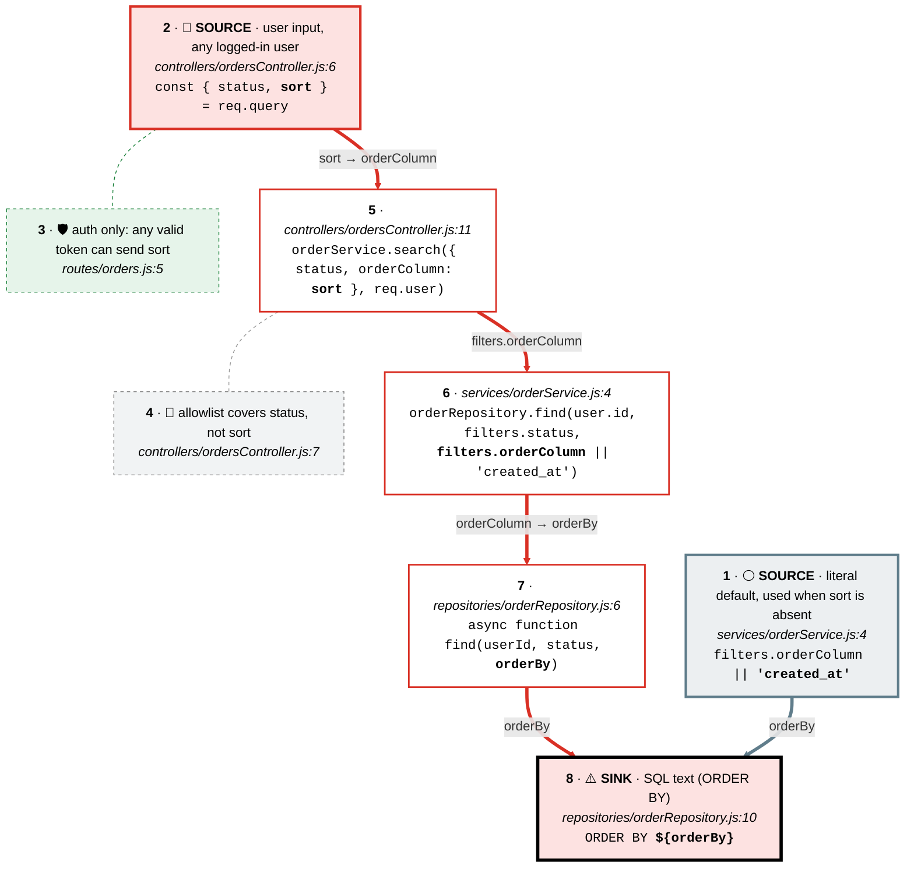
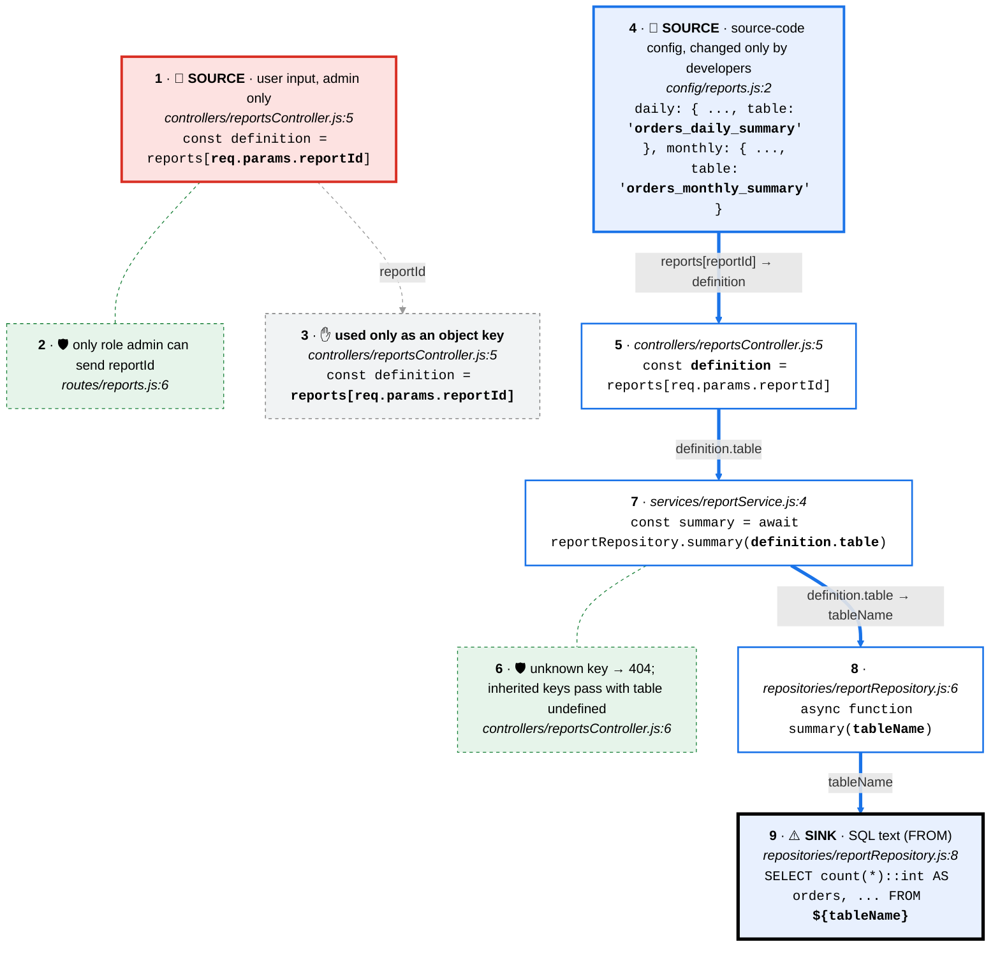

# Semgrep triage: semgrep-triage-demo

- **Scan:** Semgrep 1.177.0 · `p/default` (WARNING and ERROR, `scripts/scan.sh`) · 4 findings (4 WARNING) · `semgrep.json` of 2026-09-28 · triaged 2026-10-06. **Scope of this triage: the 2 `node-postgres-sqli` findings** (scan items 1 and 2); the path-traversal and EJS findings are not covered here.
- **Method:** each finding → source-to-sink trace → controls checked against the wiki (threat page + stack example file, including *Bypasses to check*) → verdict → severity from the rubric below.
- **Traces and tours:** `docs/traces/*.md` and `.tours/source-to-sink-*.tour`. Tour step N = card N in each diagram. Request walkthroughs: `docs/flows/*.md` and `.tours/1-list-orders.tour`, `.tours/2-show-report.tour`.
- **Assumptions:**
  - Sign-up is closed: there is no registration route in `src/routes/`, and users are only created by `db/init.sql:29` (README lists three seeded tokens). Likelihood is rated for "any authenticated regular user, accounts not self-service".
  - Stack: `express` 5, `pg` (node-postgres), `ejs`, `node` ≥ 20.6, PostgreSQL 16.
  - The app connects as `shop`, the `POSTGRES_USER` of the `postgres:16-alpine` image (`docker-compose.yml`), which that image creates as a superuser. Not confirmed on a running database.
  - Postgres was not available in this session (Docker not enabled in WSL), so nothing that touches the database was observed.

## Summary

**1 to fix: F1.** 1 dismissed (F2): the table name comes only from source-code config; it would become a true positive if `tableName` were ever taken from the request; rule kept enabled, this instance suppressed.

- **F1 · SQL injection in `ORDER BY` via `sort`** · `src/repositories/orderRepository.js:8`
  - ✅ **True positive** · 🟠 **High** ⬆️ · confidence High · Semgrep: WARNING (impact MEDIUM)
- **F2 · Table name interpolated in report summary** · `src/repositories/reportRepository.js:8`
  - ❌ False positive · confidence High · Semgrep: WARNING
  - Rule: keep enabled, suppress this instance

> [!info]- Severity rubric (click to expand)
> - **Impact:** what an attacker gets.
>   - **High:** read or change data beyond their own, obtain secrets or credentials, run code, act as another user.
>   - **Medium:** limited data exposure or change, or it needs another bug to matter.
>   - **Low:** minor information leak, no direct security effect.
> - **Likelihood:** who can reach it and how hard it is.
>   - **High:** unauthenticated, a single request, no victim interaction. Also **any authenticated user when anyone can sign up** (check: is there a public registration route?).
>   - **Medium:** any authenticated regular user when accounts aren't self-service, or it needs victim interaction.
>   - **Low:** a privileged role (admin, internal), or unlikely preconditions.
> - **Severity = Impact × Likelihood:**
>   - **High impact:** High likelihood → 🔴 Critical · Medium → 🟠 High · Low → 🟡 Medium
>   - **Medium impact:** High likelihood → 🟠 High · Medium → 🟡 Medium · Low → 🟢 Low
>   - **Low impact:** High likelihood → 🟡 Medium · Medium → 🟢 Low · Low → 🟢 Low
> - **Confidence** says how sure the verdict is, and what would change it.
>   - **High:** every hop confirmed in code, and the key behaviour confirmed locally or unambiguous.
>   - **Medium:** the verdict rests on a library or config behaving as documented, or one hop couldn't be confirmed.
>   - **Low:** important parts are inferred; say what's missing.

> [!info]- Rule decision guide (click to expand)
> - **Disable for this repo:** the rule can't be right in this codebase (it checks for something the design makes irrelevant), so every hit will be a false positive.
> - **Keep enabled, suppress this instance:** the rule finds real bugs in this codebase (or the pattern is worth a look every time), and this hit is an exception. Suppress it with a comment pointing at this triage, so the next reviewer sees why.
> - **Keep enabled, no suppression:** the false positive depends on something that could change soon; let it come back.

---

## F1 · SQL injection in `ORDER BY` via `sort` · ✅ True positive · 🟠 High ⬆️

- **Rule:** `node-postgres-sqli` · Semgrep: WARNING, impact MEDIUM, likelihood MEDIUM, confidence LOW
- **Location:** `src/repositories/orderRepository.js:8` (the expression is `ORDER BY ${orderBy}` on line 10)
- **Threat:** SQL injection · wiki: `threats/source-to-sink/sql-injection.md`, `examples/sql-injection/pg.md`
- **Verdict:** ✅ True positive
- **Severity:** 🟠 **High** = Impact High × Likelihood Medium
- **Confidence:** High: every hop from `req.query.sort` to the template literal is confirmed in code, with no control on `sort`, and the behaviour (an identifier pasted into SQL text) is unambiguous. It would only drop if a database-side restriction turned out to block sub-selects in `ORDER BY`, which Postgres does not do. Not confirmed against a running database.

**Sink:** `pool.query(\`SELECT … ORDER BY ${orderBy}\`, [userId, status || null])` (`orderRepository.js:7-11`). `orderBy` is part of the SQL text. `userId` (`$1`) and `status` (`$2`) are bound parameters and out of scope.

**Inputs reaching it**
- 🔴 **`req.query.sort`** (`src/controllers/ordersController.js:6`): user input, any logged-in user → **reaches the sink unchanged** (renamed `orderColumn` at `ordersController.js:11`, `orderBy` at `orderRepository.js:6`)
- ⚪ **`'created_at'`** (`src/services/orderService.js:4`): constant default when `sort` is empty or absent → reaches the sink (safe)

**Source-to-sink trace**
- Tour: `.tours/source-to-sink-1-orders-order-by.tour` · page: `docs/traces/orders-order-by.md`

<!-- trace: orders-order-by -->



**Controls on the path**
- `requireAuth` (`src/routes/orders.js:5`, `src/middleware/requireAuth.js:5-9`): decides who can send `sort` (any valid token), not what it contains.
- 🚫 Status allowlist (`ordersController.js:7`): **doesn't cover it**: checks `status` only.
- 🚫 Parameterised query (`orderRepository.js:11`): **doesn't cover it**: binds `userId` and `status`; identifiers can't be bound.
- 🚫 Sort allowlist: **none**. The wiki's required control for identifiers is missing.
- 🚫 Least-privilege DB user: **none** (assumed): the app connects as the image's superuser `shop` (`.env.example`, `docker-compose.yml`).

**Wiki checks** (`pg.md` · Bypasses to check)
- *Parameterised value, interpolated identifier* (the "common near-miss"): exactly this pattern: `$1`/`$2` bound, `ORDER BY ${…}` interpolated: ❌
- *`IN (...)` list or `LIMIT`/`OFFSET` pasted in:* no; but a repeated `sort` key becomes an array and is comma-joined into the `ORDER BY` text: ❌ (same bug, no extra surface)
- *`LIKE` patterns built from input:* not on this path: ✅
- *Second order:* `orders` columns are not re-read into SQL text elsewhere: ✅
- *Hand-rolled escaping:* none, so nothing to bypass: n/a
- *Check then change:* `status` is checked and the same variable is bound: ✅; `sort` is never checked: ❌
- *Placeholder numbering drift:* static query, `$1`/`$2` match the two values: ✅
- *`client.query` in helpers, migrations, seeds:* only `db/init.sql`, no runtime SQL there: ✅

**Assessment**
- **Impact: High.** `ORDER BY` accepts any expression, including `CASE` and scalar sub-selects, so the row order (and 200 vs. 500) becomes a yes/no oracle over any data the `shop` user can read. That includes `users.api_token` of the admin, so a regular user can obtain admin credentials and act as admin. If `shop` is a superuser (assumed), functions such as server-side file readers are also callable inside the expression. Stacked statements (`; …`) are unlikely: `pool.query` with a values array uses the extended protocol, one statement per call. Writes are therefore unlikely; reads of the whole database are not.
- **Likelihood: Medium.** Any authenticated regular user can reach it with ordinary requests (one per bit extracted, easily scripted), no victim interaction. Accounts are not self-service (no registration route), so not High.
- **Why Semgrep says less:** Semgrep's impact MEDIUM / confidence LOW is generic for the rule: it can't see that `orderBy` comes straight from the query string, nor that credentials live in the same database.

**Suggested fix**
- **Change:** at `src/controllers/ordersController.js:7-11`, where the controller already validates `status`, map `sort` through an allowlist of column names and pass the mapped value on. This is the wiki's *Allowlist for identifiers* option (`pg.md`).
- **Code** (suggestion, not applied):

```js
const ALLOWED_STATUSES = ['open', 'shipped', 'cancelled'];
const SORT_COLUMNS = new Map([['total', 'total'], ['status', 'status'], ['created_at', 'created_at']]);

exports.list = async (req, res) => {
  const { status, sort } = req.query;
  if (status && !ALLOWED_STATUSES.includes(status)) {
    return res.status(400).json({ error: 'invalid status' });
  }
  // Map, not a plain object: inherited keys like "constructor" must not pass
  if (sort !== undefined && !SORT_COLUMNS.has(sort)) {
    return res.status(400).json({ error: 'invalid sort' });
  }

  const orders = await orderService.search({ status, orderColumn: SORT_COLUMNS.get(sort) }, req.user);
  res.json(orders);
};
```

- **Why it holds:** the text interpolated after `ORDER BY` now always comes from the map's values (or the service's `'created_at'` default), never from the request. Arrays (`?sort=a&sort=b`), empty strings and inherited keys fail `Map.has` and get a 400, closing the comma-join variant.
- **Also:** check `orderBy` against the same list in `orderRepository.find` so that a future caller can't reintroduce it; and connect as a dedicated non-superuser role with `SELECT` on `orders` only for this query path (wiki *Mitigation*: least-privilege database user).
- **Verify:** tested only as a scratch Node check of the allowlist logic (not on a running app, no DB): `undefined` → `ORDER BY created_at`, `'total'` → `ORDER BY total`, `'price'`, `'constructor'`, `''` and `['total','status']` → 400. After applying it, with the DB up: `GET /orders?sort=total` → 200 sorted by total; `GET /orders?sort=price` → `400 {"error":"invalid sort"}` instead of 500. Note `?sort=` (empty) changes from defaulting to `created_at` to 400. Semgrep will still flag the template literal; add `// nosemgrep: javascript.lang.security.audit.sqli.node-postgres-sqli.node-postgres-sqli -- orderBy is allowlisted in ordersController (triage F1)` once the fix is in.

**Evidence**
- *Code:* `const { status, sort } = req.query;` (`ordersController.js:6`); `if (status && !ALLOWED_STATUSES.includes(status))` (`ordersController.js:7`); `orderService.search({ status, orderColumn: sort }, req.user)` (`ordersController.js:11`); `orderRepository.find(user.id, filters.status, filters.orderColumn || 'created_at')` (`orderService.js:4`); `ORDER BY ${orderBy}` (`orderRepository.js:10`); `router.get('/orders', requireAuth, ordersController.list)` (`routes/orders.js:5`).
- *Observed (local, 2026-10-06):* `GET /orders` without a token, and with `Authorization: Basic x` → `401 {"error":"missing token"}`. Nothing past authentication could be observed (no database).
- *Derived from code, not run:* `GET /orders?sort=total` with alice's token → 200, alice's orders sorted by total; `GET /orders?sort=price` → Postgres `column "price" does not exist` → `500 {"error":"internal error"}`; the allowlist check above (scratch Node, logic only).

> [!example]- Evidence (Manual Reproduction)
> 1. **Open the finding:** `semgrep.json`, result 1: `node-postgres-sqli` at `src/repositories/orderRepository.js:8`.
> 2. **Read the sink:** `src/repositories/orderRepository.js:7-11`: `pool.query` with `ORDER BY ${orderBy}` in the SQL text and only `[userId, status || null]` as values.
> 3. **Find who calls it:** `grep -rn "orderRepository.find" src` → `src/services/orderService.js:4`, third argument `filters.orderColumn || 'created_at'`.
> 4. **Find where `orderColumn` is set:** `grep -rn "orderColumn" src` → `src/controllers/ordersController.js:11`, `orderColumn: sort`.
> 5. **Find where `sort` comes from:** `ordersController.js:6`, `const { status, sort } = req.query`; the only check (`:7`) is on `status`.
> 6. **Find who can send it:** `grep -rn "ordersController.list" src` → `src/routes/orders.js:5`: `requireAuth` only, no `requireRole`; `src/middleware/requireAuth.js` accepts any token in `users.api_token`.
> 7. **Or follow it in VS Code:** CodeTour → *Source to sink 1 · sort → ORDER BY ${orderBy}* (and *List my orders* for the whole request).
> 8. **Confirm on your local instance** (`cp .env.example .env && npm install && npm run db:up && npm start`):
>    - `curl -s "localhost:3000/orders?sort=total" -H "Authorization: Bearer tok_alice_7d2f9c"` → 200, alice's three orders by total (15.99, 42.50, 120.00).
>    - `curl -s "localhost:3000/orders?sort=created_at" -H "Authorization: Bearer tok_alice_7d2f9c"` → 200, oldest first: the sort column is taken from the request.
>    - `curl -s "localhost:3000/orders?sort=price" -H "Authorization: Bearer tok_alice_7d2f9c"` → `500 {"error":"internal error"}`, and the server log shows `column "price" does not exist`: the value reached the SQL text.
>    - A stronger confirmation, described only: replace the column name with an expression whose result depends on a condition about another table, and observe that the order of alice's rows changes with the condition.

---

## F2 · Table name interpolated in report summary · ❌ False positive

- **Rule:** `node-postgres-sqli` · Semgrep: WARNING, impact MEDIUM, likelihood MEDIUM, confidence LOW
- **Location:** `src/repositories/reportRepository.js:8` (`FROM ${tableName}`)
- **Threat:** SQL injection · wiki: `threats/source-to-sink/sql-injection.md`, `examples/sql-injection/pg.md`
- **Verdict:** ❌ False positive: `tableName` only ever holds one of two table names hard-coded in `src/config/reports.js` (or `undefined`); the request only picks which one
- **Severity:** n/a
- **Confidence:** High: `summary` has a single caller, the value is read only from a source-code object, and nothing writes that object at runtime.

**Sink:** `pool.query(\`SELECT count(*)::int AS orders, coalesce(sum(total), 0) AS revenue FROM ${tableName}\`)` (`reportRepository.js:7-9`); `tableName` is the table in the SQL text. There are no bound values.

**Inputs reaching it**
- 🔴 **`req.params.reportId`** (`src/controllers/reportsController.js:5`): user input, admin only → **stops**: used only as a key into `reports`
- 🔵 **`reports.daily.table` / `reports.monthly.table`** (`src/config/reports.js:2-3`): source-code config, developers only → **reaches the sink** as `'orders_daily_summary'` or `'orders_monthly_summary'` (or `undefined` for an inherited key)

**Source-to-sink trace**
- Tour: `.tours/source-to-sink-2-report-table-name.tour` · page: `docs/traces/report-table-name.md`

<!-- trace: report-table-name -->



**Controls on the path**
- `requireAuth` + `requireRole('admin')` (`src/routes/reports.js:6`, `src/middleware/requireRole.js:2`): only admins can send `reportId`.
- 🛡 Lookup in a fixed map (`reportsController.js:5`, `config/reports.js:1-4`): **covers it**: the request text is never used as the table name; this is the wiki's *Allowlist for identifiers* pattern.
- 🛡 `!definition → 404` (`reportsController.js:6`): **covers it** for unknown keys. Inherited keys (`constructor`, `toString`) pass with `table` = `undefined`, which is still not request text.

**Wiki checks** (`pg.md` · Bypasses to check)
- *Parameterised value, interpolated identifier:* the identifier is interpolated, but it comes from the map's values, as in the wiki's *Mitigated — allowlist the identifier* example: ✅
- *Second order:* the table name is not read from the database or any store; `config/reports.js` is only `require`d: ✅
- *Check then change:* `definition.table` is passed unchanged from the lookup to the sink (`reportService.js:4`), with no re-read of `req.params`: ✅
- *Hand-rolled escaping, `LIKE`, `IN`/`LIMIT`, placeholder drift:* not present on this path: ✅

**Why it's a false positive:** user input selects *which* trusted value is used; the value in the SQL text is always a developer-written table name, never request data.

**Residual note (not a vulnerability):** `reports` is a plain object, so `GET /reports/constructor` passes the 404 check and runs `FROM undefined`, returning 500 instead of 404. Use `Object.hasOwn(reports, req.params.reportId)` (or a `Map`) in `reportsController.js:5-6`.

**Residual risk:** the verdict relies on `config/reports.js` staying static source code.

**Would become a true positive if:** report definitions move to the database or an admin-editable setting, or `summary()` gets a caller that passes request data (e.g. a `?table=` parameter).

**Rule decision: disable the rule?**
- **Decision:** keep enabled, suppress this instance.
- **Why:** 1 of this rule's 2 hits in this scan is a true positive (F1), so the rule is finding real bugs here.
- **How:** above the query in `src/repositories/reportRepository.js:7`: `// nosemgrep: javascript.lang.security.audit.sqli.node-postgres-sqli.node-postgres-sqli -- tableName comes only from src/config/reports.js (triage F2)`.
- **Revisit if:** report definitions stop being static source code, or `summary` gains another caller.

**Evidence**
- *Code:* `const definition = reports[req.params.reportId];` (`reportsController.js:5`); `if (!definition) return res.status(404).json({ error: 'unknown report' });` (`reportsController.js:6`); `daily: { title: 'Orders in the last 24 hours', table: 'orders_daily_summary' }`, `monthly: { …, table: 'orders_monthly_summary' }` (`config/reports.js:2-3`); `reportRepository.summary(definition.table)` (`reportService.js:4`); `FROM ${tableName}` (`reportRepository.js:8`); `router.get('/reports/:reportId', requireAuth, requireRole('admin'), reportsController.show)` (`routes/reports.js:6`).
- *Observed (local, 2026-10-06):* `GET /reports/daily` without a token, and with `Authorization: Basic x` → `401 {"error":"missing token"}`.
- *Derived from code, not run:* bob's token → `403 {"error":"forbidden"}`; admin + `/reports/daily` → 200 `{"title":"Orders in the last 24 hours","orders":2,"revenue":"352.50"}` (with fresh seed data); admin + `/reports/weekly` → `404 {"error":"unknown report"}`; admin + `/reports/constructor` → `500 {"error":"internal error"}` (`relation "undefined" does not exist`).

> [!example]- Evidence (Manual Reproduction)
> 1. **Open the finding:** `semgrep.json`, result 2: `node-postgres-sqli` at `src/repositories/reportRepository.js:8`.
> 2. **Read the sink:** `src/repositories/reportRepository.js:6-9`: `summary(tableName)` interpolates `tableName` after `FROM`.
> 3. **Find who calls it:** `grep -rn "summary(" src` → only `src/services/reportService.js:4`, `reportRepository.summary(definition.table)`.
> 4. **Find where `definition` comes from:** `grep -rn "reportService.build" src` → `src/controllers/reportsController.js:8`; `definition` is `reports[req.params.reportId]` (`:5`).
> 5. **Read the config:** `src/config/reports.js`: two entries with fixed `table` strings. `grep -rn "config/reports" src` → only `reportsController.js:1` reads it; nothing writes it.
> 6. **Find who can send `reportId`:** `src/routes/reports.js:6`: `requireAuth`, then `requireRole('admin')`.
> 7. **Or follow it in VS Code:** CodeTour → *Source to sink 2 · reports[reportId].table → FROM ${tableName}* (and *Revenue report* for the whole request).
> 8. **Confirm on your local instance** (`npm run db:up && npm start`):
>    - `curl -s localhost:3000/reports/daily -H "Authorization: Bearer tok_bob_3a8e1b"` → `403 {"error":"forbidden"}`.
>    - `curl -s localhost:3000/reports/daily -H "Authorization: Bearer tok_admin_c41f6e"` → 200 with title, orders and revenue.
>    - `curl -s localhost:3000/reports/weekly -H "Authorization: Bearer tok_admin_c41f6e"` → `404 {"error":"unknown report"}`: any name outside the config is rejected before SQL.
>    - `curl -s localhost:3000/reports/constructor -H "Authorization: Bearer tok_admin_c41f6e"` → 500 (the residual note), with `relation "undefined" does not exist` in the server log.
